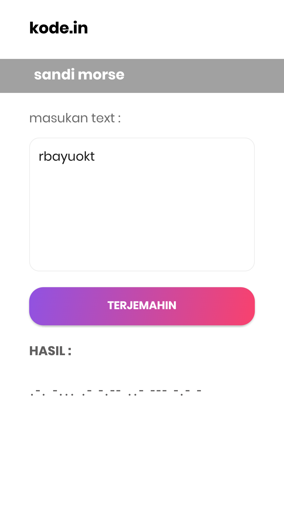
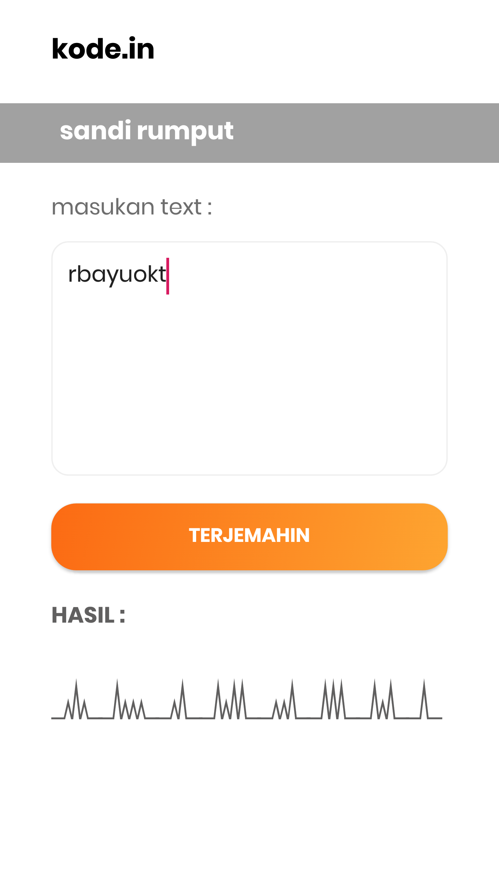
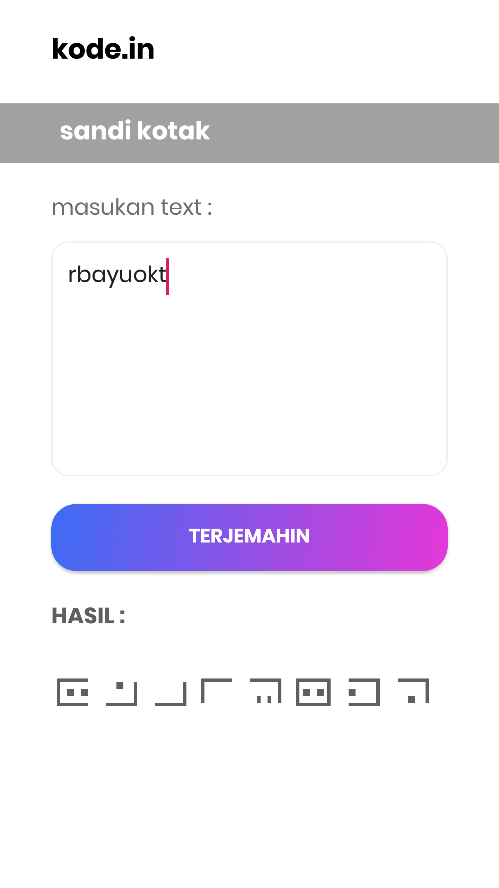
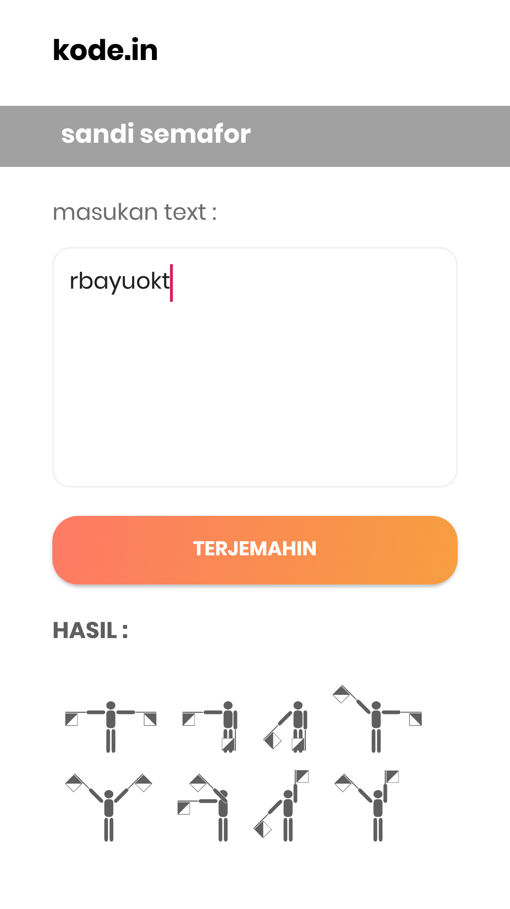

# kode.in
 application to help the scout in converting text into scout code in second 
 android based. I make this apps with android studio and adobe xd for the mockup.
 
# Features
here's the the features of this apps :
- [x] Convert to morse-code
- [x] Convert to grass-code
- [x] Convert to square-code
- [x] Convert to semaphore-code
- [x] allow to copy the result text

# Screenshoot
here's the screenshoot of the apps that I made, hope you like it

**Dashboard**  
 

**Morse Code Converter**  
 

**Grass Code Converter**  
 

**Square Code Converter**  
 

**Semphore Code Converter**  
 

**Credit Page**  
 

made with :heart: in Cimahi by [@rbayuokt](https://www.instagram.com/rbayuokt/) :thumbsup:
