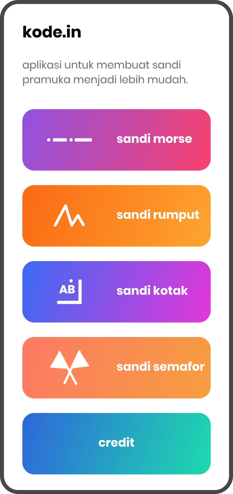
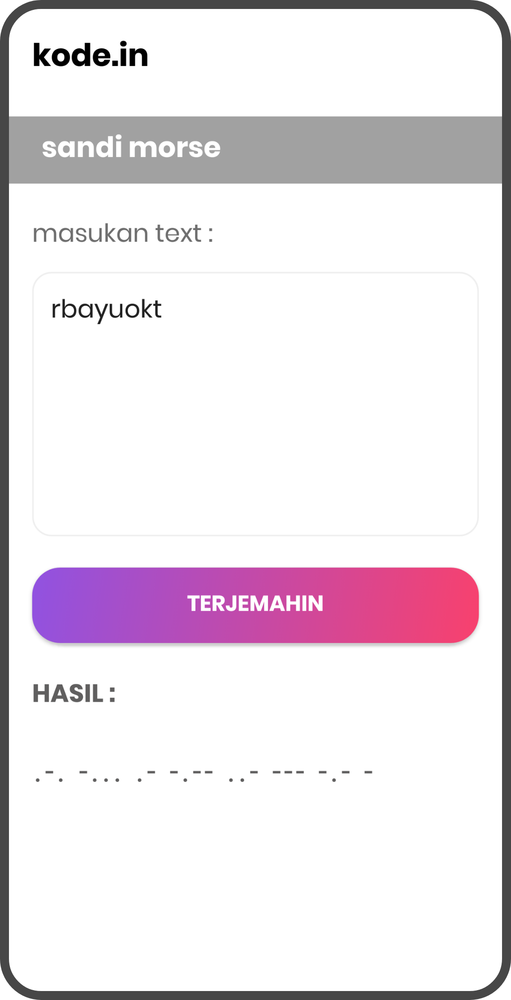
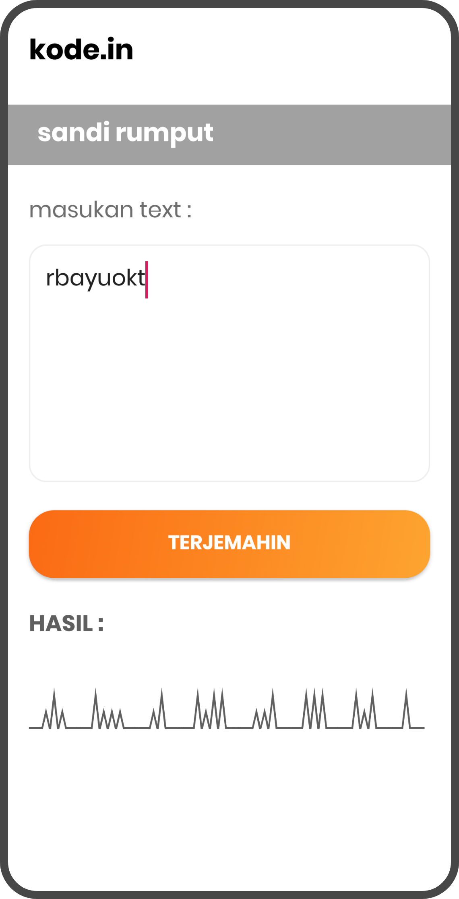
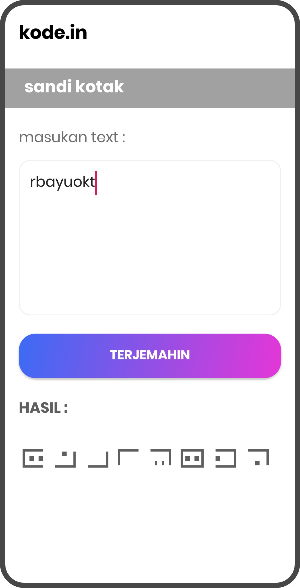
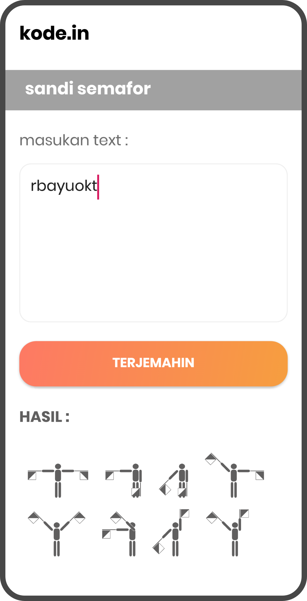
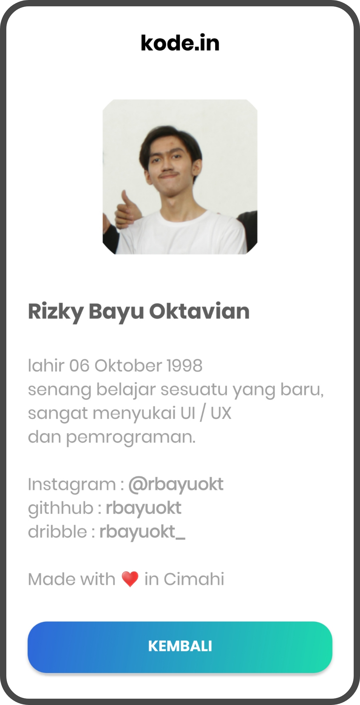

# kode.in
 Android based application build to help scouts convert text into *Morse code* in seconds! This application build with Android Studio.
 
 [](https://forthebadge.com) [](https://forthebadge.com)<br>
 [](https://shields.io/) [](https://shields.io/)
 
## NOTES
 **Do not publish this apps without my permission or try to claim this apps is yours!!!** <br>
 **that will broke my heart :(**

## Table of Contents
* [Features](#features)
* [Screenshoots](#screenshoots)
* [Technology Stack](#technology-stack)
* [Development Setup](#development-setup)
* [Structure Directory](#structure-directory)
* [Authors](#authors)
* [Contributors](#contibutors)
* [License](#license)
* [Acknowledgments](#acknowledgments)

## Features
Here's the the features of this apps :
- [x] Convert to morse-code
- [x] Convert to grass-code
- [x] Convert to square-code
- [x] Convert to semaphore-code
- [x] allow to copy the result text

## Screenshoots
here's the screenshoot of the apps that I made, hope you like it

**Dashboard :**<br><br>
<br>

**Features :**<br><br>
   

**Credit Page :**<br><br>
<br>

## Technology Stack
* Programming Language : Java
* IDE: Android Studio https://developer.android.com/studio/
* Another Stack: Card View

## Development Setup
To start this *development project*, make sure you have installed `Android Studio` and `Android sdk`. To start this project:
- Run Android Studio
- Choose Import project from version control
- Input link respository Bitbucket: https://github.com/rbayuokt/kode.in

If it goes well, the project will be able to open in Android Studio and it can be build.
Make sure you read this `README.md`

## Structure Directory
Struktor folder sangat penting untuk diketahui agar tim mengatahui fungsi-fungsi tiap-tiap folder tujuannya agar memiliki persepsi yang sama. Berikut merupakan struktur folder dari project ini:
skeleton
```bash
├── kode.id
│   ├── src
│   │   ├──  main
│   │   |    |──  java
│   │   |    |──  res
```

The explanation of the above folders is as follows:
- **java** is folder which is used to store java files.
- **res** is folder that is used to store assets such as layout, fonts, images, and others.

## Authors
* **Rizky Bayu Oktavian** - *kode.in developer* - [@rbayuokt](https://www.instagram.com/rbayuokt/)
* made with :heart: in Cimahi

## Contibutors
* **Fladio Armandika** - *Contributor* - [FladioArmandika](https://github.com/FladioArmandika)
* **Nenza Nurfirmansyah** - *Contributor* - [nenzan](https://github.com/nenzan)

## License
This project is licensed under the MIT License - see the [LICENSE.md](LICENSE) file for details

## Acknowledgments
* Hat tip to anyone whose code was used
* Inspiration
* etc
